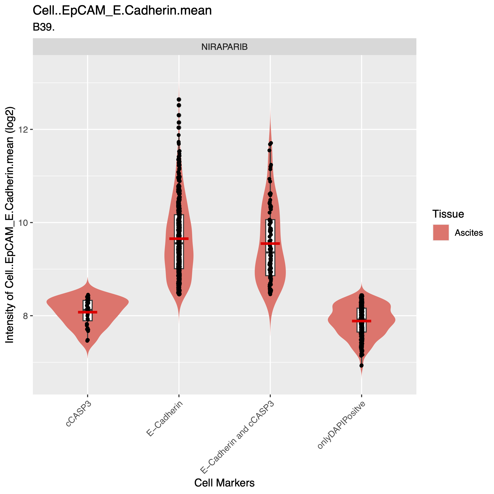
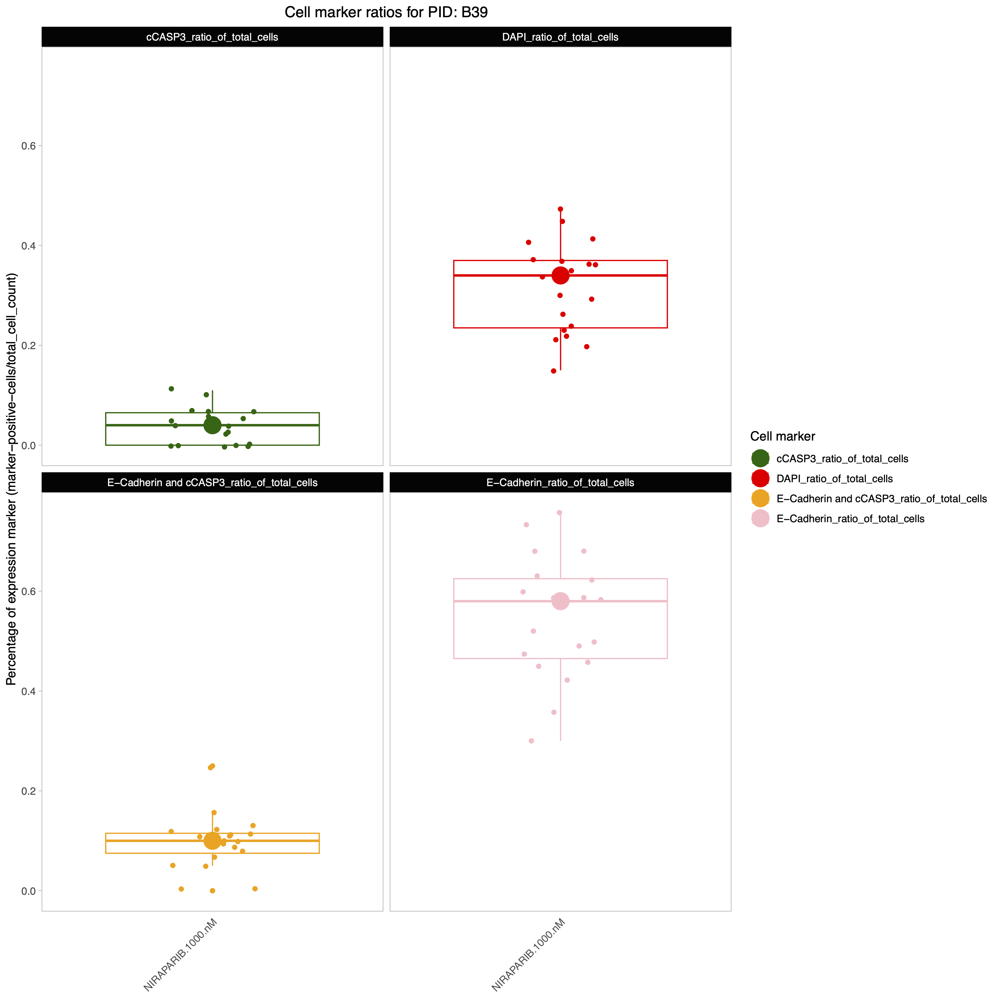
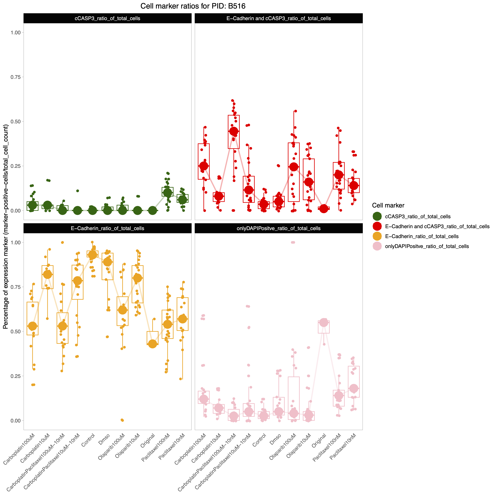

# Overview
DRUGSENS is a R-package tha allow users to automatically analyze QuPath&trade; output data from imaging analysis. 
Here we include a QuPath&trade; script to run reproducible QuPath&trade;-based image analysis, and some examples on how DRUGSENS can be used. For more detailed examples of QuPath&trade; scripting please refer to [QuPath&trade;'s Documentation](https://qupath.readthedocs.io/en/stable/). 
This script should be placed into scripts within QuPath&trade;. We tested this code to a previous version of QuPath&trade.
This packge is complementary to the STAR protocol: `...`

# Installation

``` r
devtools::install_gitlab("https://git.scicore.unibas.ch/ovca-research/drugsens")
# OR
devtools::install_github("https://github.com/flalom/drugsens") # this is the mirroring repo of the gitlab
```

`devtools` is required to install DRUGSENS. If `devtools` is not installed yet you can install it with:

``` r
# Install devtools from CRAN
install.packages("devtools")

# Or the development version from GitHub:
# install.packages("pak")
pak::pak("r-lib/devtools")
```

You can have a look at it [devtools](https://github.com/r-lib/devtools)

# Usage

## Example

We recommend making a new project when working with `DRUGSENS`, to have clear and defined path. This will make the data analysis much easier and reproducible. 
You can also set you working directory with `setwd()`.

### QuPath script used

To make the QuPath script locally available within the working directory, with the currents date:

``` r
library("DRUGSENS")
generate_qupath_script()
```

This function will generate a `script_for_qupath.txt` file with the code that one can copy/paste into the __QuPath's script manager__. All the sections that contain \<\> should be replaced with the user experimental information. The `columnsToInclude` in the script should also be user defined, depending on the markers used. 

It is very important that the file naming structure of the QuPath's output is maintained for `DRUGSENS` to work correctly.

``` groovy
//This groovy snipped script was tested with QuPath 4

import qupath.lib.gui.tools.MeasurementExporter
import qupath.lib.objects.PathCellObject
import qupath.lib.objects.PathDetectionObject

// Get the list of all images in the current project
def project = getProject()
def imagesToExport = project.getImageList()

// Separate each measurement value in the output file with a tab ("\t")
def separator = ","

// Choose the columns that will be included in the export
// Note: if columnsToInclude is empty, all columns will be included
def columnsToInclude = new String[]{"Image", "Name", "Class","Centroid X µm","Centroid Y µm","Nucleus: Area", "Nucleus: DAPI mean","Nucleus: E-Cadherin mean", "Nucleus: Cleaved caspase 3 mean", "Cell: Area","Cell: E-Cadherin mean", "Cell: Cleaved caspase 3 mean","Cytoplasm: E-Cadherin mean","Cytoplasm: Cleaved caspase 3 mean","Nucleus/Cell area ratio"}

// Choose the type of objects that the export will process
// Other possibilities include:
//    1. PathAnnotationObject
//    2. PathDetectionObject
//    3. PathRootObject
// Note: import statements should then be modified accordingly
def exportType = PathCellObject.class

// Choose your *full* output path
def outputPath = "<USER_DEFINED_PATH>/<PID>_<TISSUE>_',Sys.Date(),'_<SAMPLE_DOC>_<TREATMENT_INITIALS>_<CONCENTRATION>_<CONCENTRATION_UNITS>_<REPLICA_OR_NOT>_<TUMOR_MARKER>_<APOPTOTIC_MARKER>.csv"
def outputFile = new File(outputPath)
// example <USER_DEFINED_PATH>/B39_Ascites_2023.11.10_DOC2023.10.05_Niraparib_1000_nM_Rep_EpCAM_Ecad_cCasp3_ QuPath will add (series 1, 2 ...etc) at the end of this line, to indicate the stack number
// example <USER_DEFINED_PATH>/B39_Ascites_2023.11.10_DOC2023.10.05_Niraparib_1000_nM_Rep_EpCAM_Ecad_cCasp3_(series 01).tif
//"PID.001_Ascites_2023-11-25_DOC2020-12-14_CarboplatinPaclitaxel_100_uM_10_nM_Ecad_cCasp3_(series 01).tif"
//"A8759_Spleen_2020.11.10_DOC2001.10.05_Compoundx34542_1000_uM_EpCAM_Ecad_cCasp3_(series 01).tif"
//"A8759_Spleen_2020.11.10_DOC2001.10.05_Compoundx34542_1000_uM_EpCAM_Ecad_cCasp3_(series 01).tif"
//"B38_Eye_2023.11.10_DOC2023.10.05_GentamicinePaclitaxel_100_uM_10_nM_EpCAM_Ecad_cCasp3_(series 01).tif"

// Create the measurementExporter and start the export
def exporter  = new MeasurementExporter()
        .imageList(imagesToExport)            // Images from which measurements will be exported
        .separator(separator)                 // Character that separates values
        .includeOnlyColumns(columnsToInclude) // Columns are case-sensitive
        .exportType(exportType)               // Type of objects to export
        .exportMeasurements(outputFile)       // Start the export process

print "Done!"
```

> 📝**NOTE** 
>The column `Image` must be present in the data for DRUGSENS to parse the metadata correctly. Title style (This Is An Example) is fine, but if you have a drug combination refer to the formatting as described below [Handling drug combinations](#bind-qupath-files).

### Generate configuration file
This command will generate a `config_DRUGSENS.txt` that should be edited to include the names of the cell markers that have been used by the experimenter.
In our case we replaced `"PathCellObject"` with `"onlyDAPIPositve"`.

``` r
make_run_config()
```
Once the file `config_DRUGSENS.txt` has been modified; you can feed it back to `R`; this will be done automatically once you run `data_binding()`.
Now the `list_of_relabeling` should be available in the R environment and it can be used by `DRUGSENS` to work. `list_of_relabeling` is a named list that is required for relabeling the markers name, that is often not user friendly. 
In case the markers naming doesn't need corrections/relabeling you can leave the `list_of_relabeling` unchanged (but one should still check it).

> 📝**NOTE** It is recommended having no spaces and using camelCase style for the **list of cell markers**:
>
> - Start the name with a lowercase letter.
> - Do not include spaces or underscores between words.
> - Capitalize the first letter of each subsequent word.


### Explore example datasets

We present here a few mock datasets, as example workflow. Those files can be explored from the user's R package path:
``` r
system.file("extdata/to_merge/", package = "DRUGSENS")
```

### Bind QuPath files
At first the data is a bunch of separate files which are difficult to make sense of; therefore as first step let's bind them together into a single R dataframe! This should take very little time.
The example data can be bound together with this command:
``` r
bind_data <- data_binding(path_to_the_projects_folder = system.file("extdata/to_merge/", package = "DRUGSENS"), files_extension_to_look_for = "csv")
```
You will be now able to `View(bind_data)`. You should see all the image stacks from the QuPath in one dataframe. This dataframe will have all the metadata parsed from the `Image` column value for every stack (image x) (this is the first column defined in the in `columnsToInclude` within the `script_for_qupath.txt`). 
In this code snippets we show an example of mock data `unique(bind_data$PID)` with PIDs: `"A8759" "B36"   "B37", "B38", "B39"` and tissue `"Spleen", "p.wash", "Ascites", "Eye"``. You will have all the metadata in one go and also for drug combinations!

> ⚠️ **WARNING**: As long as you keep the formatting as the above examples. 
The dates should also be in the format **yyy-mm-dd**. For the double combinations the two drugs should be written together with each of the different drug capilized (**C**arboplatin**P**aclitaxel) and the rest lowercased letters. 
For example **CarboplatinPaclitaxel_100_uM_10_nM**. This indicates a drug combination of Carboplatin 100_uM and Paclitaxel 10_nM. Each drug amount and each unit should always be separated by `_`. The first 100_uM belongs to the Carboplatin and the 10_nM belongs to the Paclitaxel. Those constrains are due to the parsing of the strings into useful metadata. If some of the data is not present, you can use a `.` separated by `_`. If you need additional data parsing, please let us know by filing an issue on GitLab [GitLab Issue]("https://git.scicore.unibas.ch/ovca-research/DRUGSENS/issues").

### Counting the number of positiive cells for each marker in every image
This function will take the previous step's generated dataframe and it will counts image by image (sum the markers of every stack) for every sample the number of marker occurrences. 
``` r
counts_dataframe <- make_count_dataframe(bind_data)
```

### Some plotting
This function will take the previous step's generated dataframe (`bind_data`) and it will generate some plots for every cell marker and for some key features from the QuPath metadata, such as nucleus area of the markers and the mean of expression per maker. The script will generate separate folders for each PID in the dataset. There might be quite some plots, therefore you can isolate specific PID or specific treatment, if that is required. With `fill_color_variable` different variables present in the metadata can be tested to visualize the data.
``` r
get_QC_plots_parsed_merged_data(bind_data, 
                                fill_color_variable = "Tissue", 
                                save_plots = TRUE)
# OR
get_QC_plots_parsed_merged_data(bind_data, 
                                fill_color_variable = "Treatment_complete", 
                                save_plots = TRUE)
```

<br>

### Making plotting-ready data
This function will change the wider format into longer format keeping all the metadata
``` r
plotting_ready_dataframe <- change_data_format_to_longer(counts_dataframe)
```
### Make a plot
Visualizing the results of the previous steps is essential to asses your experiment.
``` r
get_QC_plots(plotting_ready_dataframe, save_plots = TRUE, isolate_a_specific_patient = "B39")
```

<br>

## Run with user's data

Let's run `DRUGSENS` with your data. `DRUGSENS` is not very strict about the capitalization of the file name but is very strict on the position of the parameters. This to avoid potential parsing problems. Here how the labeled data should look like in your QuPath generated file. Here below is shown a the first row from the file `A8759_drug1..conc2.csv` contained as example in `system.file("extdata/to_merge/", package = "DRUGSENS")`

```         
A8759_p.wash_2020.11.10_DOC2001.10.05_compoundX34542_10000_uM_EpCAM_Ecad_cCasp3_(series 01).tif
```

That follows the structure suggested in the QuPath script

```         
"<USER_DEFINED_PATH>/<PID>_<TISSUE>_',Sys.Date(),'_<SAMPLE_DOC>_<TREATMENT_INITIALS>_<CONCENTRATION>_<CONCENTRATION_UNITS>_<REPLICA_OR_NOT>_<TUMOR_MARKER>_<APOPTOTIC_MARKER>.csv"
```
> ⚠️ **WARNING**: It is highly recommended to follow the recommended naming structure to obtain the correct output. The dates should also be in the format **yyy-mm-dd**. For the double combinations the two drugs should be wrote together with each of the different drug capilized (**C**arboplatin**P**aclitaxel) and the rest lowercased letters. 
For example **CarboplatinPaclitaxel_100_uM_10_nM**. This indicates a drug combination of Carboplatin 100_uM and Paclitaxel 10_nM. Each drug amount and each unit should always be separated by `_`. The first 100_uM belongs to the Carboplatin and the 10_nM belongs to the Paclitaxel. Those constrains are due to the parsing of the string into useful metadata. If some of the data is not present, you can use a `.` separated by `_`.

### Data Binding and Processing

These lines sets stage for `DRUGSENS` to find the directory path where the microscopy image data are located. `defined_path` is a predefined variable that should contain the base path. This makes it easier to access and manage the files during processing. It is convenient also to define the `desired_file_extensions_of_the_files`, usually `csv` is a good start.

``` r
defined_path <- "<USER_DEFINED_PATH>"
desired_file_extensions <- "csv"
```

You can then

``` r
bind_data <- data_binding(path_to_the_projects_folder = defined_path, 
files_extension_to_look_for = desired_file_extensions, recursive_search = FALSE)
```

> 📝**NOTE**It is recommended to run `data_binding()` with `recursive_search = FALSE` in the case that the target folder has subfolders that belong to other projects that use other cell markers. 

Each file is read, and additional metadata is extracted. This will return a dataframe of all the csv files within the folder merged with some additional parsing, the metadata is parsed from the file name will be retrieved and appended to the data. Metadata such as:

- **PID** = A unique identifier assigned to each sample. This ID helps in distinguishing and tracking individual samples' data throughout the experiment.
- **Date1** = The date on which the experiment or analysis was conducted. This field records when the data was generated or processed.
- `DOC` = The date when the biological sample was collected.
- `Tissue` = Indicates the type of tissue from which the sample was derived. This could be a specific organ or cell type
- `Image_number` = Represents the order or sequence number of the image in a stack of images
- `Treatment` = The name or type of drug treatment applied to the sample
- `Concentration` = The amount of the drug treatment applied (concentration), quantitatively described.
- `ConcentrationUnits` = The units in which the drug concentration is measured, such as micromolar (uM) or nanomolar (nM)
- `ReplicaOrNot` = Indicates whether the sample is a replica or repeat of a previous experiment
- `Name` = The standardized name of the cell markers as defined in the `config_DRUGSENS.txt` file. This ensures consistency and accuracy in identifying and referring to specific cell markers. 


### A first QC plot
``` r
plots <- get_QC_plots_parsed_merged_data(bind_data, 
fill_color_variable = "Treatment_complete", save_plots = TRUE)
``` 

<br>
This plots shows the ratio of expressed markers in the various conditions, other variables (for `example Tissues` or `Treatment_complete`) can also be used. The data will be, by default, be saved in the current working directory in a folder called `figures` and will make subfolders for each PID present in the dataset.

- `.data`: The main dataset, expected to be a dataframe that has been preprocessed and formatted into a long format.
- `list_of_columns_to_plot`: Specifies which columns in the data should be visualized. Defaults to all numeric columns if not provided.
- `save_plots`: A boolean flag indicating whether the plots should be saved as files.
- `saving_plots_folder`: The directory where plot files will be saved, with "figures" as the default.
- `fill_color_variable`: Specifies a variable in the data to use for color-coding the plots, enhancing the visual distinction between different data groups.
- `PID_column_name`, isolate_specific_drug, isolate_specific_patient: Parameters allowing for the isolation of data based on patient ID or specific treatment, facilitating targeted analysis.
- `drug_column_name`: Defines the column that indicates the treatment or drug, with "Treatment" as the default.
- `save_list_of_plots`, `save_plots_in_patient_specific_subfolders`: Flags controlling the saving behavior of the plots, including the option to save in patient-specific subfolders for organized file management.
- `p_height`, `p_width`: Parameters to customize the height and width of the generated plots, ensuring they fit the desired visualization scale.
    
### Cell markers counting

`make_count_dataframe()`, is designed for processing microscopy data stored in a dataframe. It counts occurrences of different markers present in the dataset and computes additional metadata based on unique identifiers within each row.

``` r
cell_markers_counts_data <- make_count_dataframe(bind_data)
```
- `.data`: The input dataframe containing microscopy data.
- `unique_name_row_identifier`: The name of the column in .data that contains unique identifiers for each row (default is "filter_image").
- `name_of_the_markers_column`: The name of the column in .data that contains the names of the markers (default is "Name").

> 📝**NOTE** `make_count_dataframe()` accepts directly the `bind_data` generated in the previous step, unless the fiels were modified, in that case the paramenters `unique_name_row_identifier` and `name_of_the_markers_column` should be passed to the function.

The data output will be a dataframe, with all the metadata coming from the previous preprocessing. At this point, you can you the data already, but you can additionally change the format from wider to longer. This is useful especially for plotting and more fine analysis.

### Prepare the data for plotting

`change_data_format_to_longer`, transforms count data from a wide format to a longer format, making it more suitable for certain types of analysis or visualization.
- `.data`: The input dataframe containing count data in a wide format, typically generated from microscopy data processing.
- `pattern_column_markers`: A pattern used to identify columns related to marker ratios (defaults to "_ratio_of_total_cells").
- `unique_name_row_identifier`: The name of the column in .data that contains unique identifiers for each image (defaults to "filter_image").
- `additional_columns`: A logical value indicating whether to include additional metadata columns in the longer format dataframe. It defaults to TRUE.
    
``` r
plotting_format <- change_data_format_to_longer(cell_markers_counts_data)
```


> 📝**NOTE** `change_data_format_to_longer()` accepts directly the `cell_markers_counts_data` generated in the previous step, unless the fiels were modified, in that case the paramenters `pattern_column_markers` and `unique_name_row_identifier` and `additional_columns` should be passed to the function.

This will return a dataframe that can be easily used for plotting and additional analyses.

### QC plotting

get_QC_plots, is designed for generating Quality Control (QC) plots from preprocessed microscopy data. It visualizes cell marker ratios across different treatments for each patient or a specific patient, aiding in the immediate assessment of data quality and trends.
Input Parameters:

``` r
get_QC_plots(plotting_format, isolate_a_specific_patient = "A8759", save_plots = T)
```
More parameters can be specified to personalize the plot(s).

- `.data`: The preprocessed and merged dataframe, expected to be in a long format, typically obtained after processing through make_count_dataframe() and change_data_format_to_longer().
- `patient_column_name`: Specifies the column in .data that contains patient identifiers (defaults to "PID").
- `colors`: A vector of colors for the plots. Defaults to c("darkgreen", "red", "orange", "pink").
- `save_plots`: A Boolean flag indicating whether to save the generated plots. If TRUE, plots are saved in the specified directory.
- `folder_name`: The name of the folder where plots will be saved if save_plots is TRUE. Defaults to "figures".
- `isolate_a_specific_patient`: If specified, QC plots will be generated for this patient only. Defaults to NULL, meaning plots will be generated for all patients.
- `x_plot_var`: The variable to be used on the x-axis, typically indicating different treatments. Defaults to "Treatment_complete".

## Contributing

We welcome contributions from the community! Here are some ways you can contribute:

- Reporting bugs
- Suggesting enhancements
- Submitting pull requests for bug fixes or new features

### Setting Up the Development Environment

To get started with development, follow these setup instructions:

<details>
<summary>Development Environment Setup</summary>

This project uses `renv` for R package management to ensure reproducibility. To set up your development environment:

1. Clone the repository to your local machine.
2. Open the project in RStudio or start an R session in the project directory.
3. Run `renv::restore()` to install the required R packages.

Renv will automatically activate and install the necessary packages as specified in the `renv.lock` file.

</details>

### Reporting Issues
If you encounter any bugs or have suggestions for improvements, please file an issue using our [GitLab Issue]("https://git.scicore.unibas.ch/ovca-research/DRUGSENS/issues"). Be sure to include as much information as possible to help us understand and address the issue.

Please make sure to file the issue in gitlab as the GitHub is a mirror repo.
